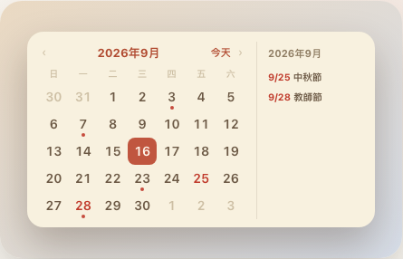
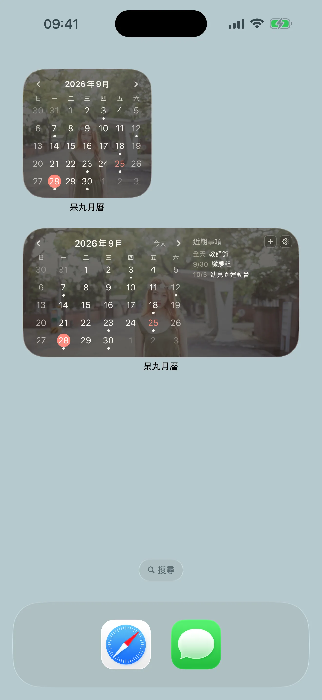
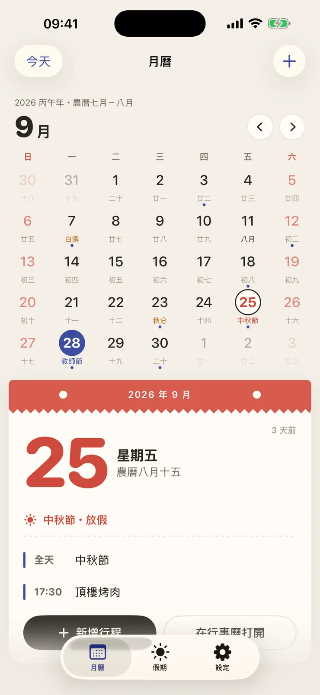
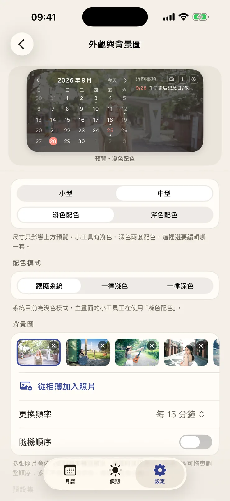

# 呆丸月曆

台灣人的月曆小工具，**Mac、iPhone、iPad 都能用**。標好台灣國定假日、補班日與農曆，可以直接在小工具上翻月、點日期看行程，還能放上自己的照片當背景。

官網：[taical.andyshiu.com](https://taical.andyshiu.com)

**這個 repo 只放 Mac 版安裝檔與假日資料**，程式碼未公開。

| | Mac | iPhone／iPad |
|---|---|---|
| 形式 | 桌面小工具 | 主畫面小工具＋App |
| 價格 | 免費，全部功能 | 免費下載；進階版 NT$90 買斷 |
| 下載 | [本頁下載 dmg](#mac-版) | [App Store](https://apps.apple.com/tw/app/id6816707196) |
| 需求 | macOS 14.0 以上，Apple 晶片 | iOS／iPadOS 17 以上 |

---

## Mac 版

### 下載

[下載最新版](../../releases/latest/download/TaiCal.dmg)，或到 [Releases](../../releases) 頁面選擇版本。

> `TaiCal.zip` 是 App 自動更新用的，一般安裝請下載 `TaiCal.dmg`。

### 安裝

1. 打開下載的 `TaiCal.dmg`，把圖示拖到「應用程式」資料夾
2. 開啟 App，它會告訴你怎麼把小工具放到桌面
3. 桌面空白處按住 Control 鍵並點一下 → **編輯小工具** → 搜尋「呆丸月曆」
4. 選小型或中型拖到桌面

App 已經過 Apple 公證，下載後可以直接開啟。

### 功能

- 月曆格線，標示今天與台灣國定假日（含補班日）
- 農曆（預設關閉，可開啟）
- 小工具上直接翻月；中型尺寸可點選日期查看當天事項
- 顯示行事曆事件，可逐一勾選要顯示哪些來源
- 點右側的事項可開啟「行事曆」並跳到該日
- 自訂配色與背景圖，淺色與深色各一套
- 新版本自動檢查與更新

---

## iPhone／iPad 版

  
  
  

### 下載

本頁不提供 iPhone／iPad 的安裝檔，請到 App Store 下載。

### 安裝

1. 從 App Store 下載「呆丸月曆」
2. 長按主畫面的空白處，直到圖示開始晃動
3. 點左上角的「編輯」→「加入小工具」
4. 搜尋「呆丸月曆」，選擇小型或中型，按「加入小工具」

### 功能

- **放上你的照片**：用自己的照片當小工具背景，好幾組配色可以挑，淺色、深色模式都好看
- **台灣的月曆**：國定假日、補班、農曆、二十四節氣，還有七夕、中元、尾牙、除夕等傳統節日
- **連假與請假攻略**：每段連假都幫你算好要請哪幾天、可以連休幾天，下一個假日還有幾天也看得到
- **小工具上就能用**：翻月、回到今天、點日期看當天行程，按「＋」新增行程
- **看得到你的行程**：有行程的日子會出現圓點，中型小工具旁邊列出近期行程；新增和修改一樣用內建「行事曆」
- iPad 橫向時月曆與當天詳情左右並排

### 進階版（NT$90，買一次，用一輩子）

- 放很多張照片輪流播，小工具上還能按「下一張」
- 每個顏色都能自己調
- 之後出的新功能不用再付錢

家人可以一起共享。免費版就能使用月曆、假日、農曆、請假攻略、行程與一張背景照片。

---

## 隱私

行事曆與照片只在你的裝置上讀取與使用，不會上傳任何地方。沒有追蹤，沒有廣告。

隱私權政策：[taical.andyshiu.com/privacy.html](https://taical.andyshiu.com/privacy.html)

## 假日資料

來自[政府資料開放平臺的「政府行政機關辦公日曆表」](https://data.gov.tw/dataset/14718)，由行政院人事行政總處公告，涵蓋 2017–2027 年。

新年度的日曆表公告後，Mac 與 iPhone／iPad 版都會自動取得，不必重新安裝；也可以在設定裡手動檢查更新。

## 問題回報

有任何問題或建議，歡迎到 [Issues](../../issues) 留言。
